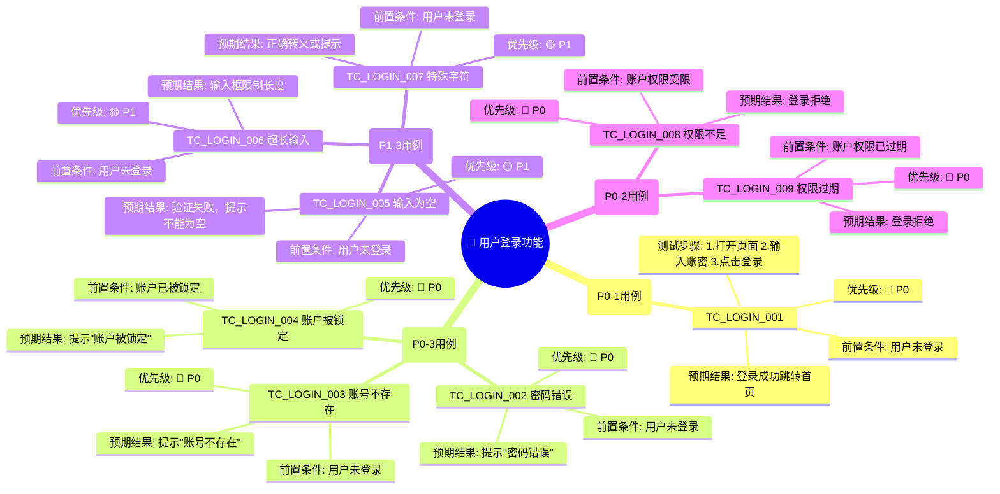

# 测试用例生成器 Skill 系统 v2.0

## 📋 项目概述

**核心目标**：
- 支持多种输入格式（业务功能描述、需求文档文件）
- 自动生成思维导图展示测试点
- 自动生成符合软件测试行业规范的、结构化测试用例
- 覆盖完整的功能测试场景
- 确保测试质量和可溯源性

**新增功能**：
- 📥 支持多源输入（文本描述 + 文档文件）
- 🧠 生成测试点思维导图
- 📊 完整的工作流程可视化

---

## 🎯 五个核心模块的优化Prompt语

### 0️⃣ **InputParser - 输入解析器** ⭐ 新增

#### 角色定义
你是一个文档和需求解析专家，能够处理多种格式的输入信息，包括用户直接描述的业务功能、上传的需求文档文件、产品规格书等。

#### 核心职责
1. **输入识别**：识别和解析以下类型的输入
   - 文本型输入：用户直接描述的业务功能
   - 文档型输入：需求文档、产品规格书（PDF/Word/Excel/Markdown等）
   - 混合型输入：文本描述 + 附加文档

2. **内容提取**：从各类文档中准确提取关键信息
   - 功能描述和业务逻辑
   - 系统流程和用户操作步骤
   - 异常处理和边界条件
   - 权限和安全要求
   - 非功能性需求（性能、兼容性等）

3. **信息规范化**：将提取的信息转换为标准化格式
   - 统一的需求格式
   - 清晰的功能点列表
   - 结构化的业务规则

#### 输出格式
生成结构化的规范化需求文档，包含：
- 原始输入来源标注
- 提取的功能模块列表
- 关键业务规则汇总
- 潜在异常场景预识别
- 可能的边界条件标记

#### 质量要求
- 准确保留原意，避免理解偏差
- 完整提取所有关键信息
- 识别隐含的业务需求
- 标注需要澄清的不清楚之处

---

### 1️⃣ **Analyzer - 需求深度解析器**

#### 角色定义
你是一个资深的测试需求分析专家，需要对业务功能描述进行深度解析，为后续的测试用例生成提供清晰的需求基础。

#### 核心职责
1. **需求理解**：准确理解用户提供的业务功能描述
2. **场景识别**：识别出以下四大核心测试场景类型
   - 正常流程（Happy Path）：业务正常执行路径
   - 异常操作（Exception Handling）：用户误操作、系统异常
   - 边界条件（Boundary Cases）：输入限制、数据边界
   - 权限校验（Authorization）：用户权限、访问控制
3. **优先级分配**：按照以下优先级排序
   - P0：用户高频操作、核心业务链路、高危边界场景
   - P1：常规功能点
   - P2：非核心功能

#### 输出格式
生成结构化的需求解析结果，包含：
- 功能点列表（子功能模块）
- 各功能点的场景分类
- 测试优先级标注
- 关键业务规则提取

#### 质量要求
- 不遗漏任何核心业务逻辑
- 场景分类准确、无重复
- 优先级评估合理

---

### 1️⃣.5️⃣ **MindmapGenerator - 思维导图生成器** ⭐ 新增

#### 角色定义
你是一个测试点可视化专家，需要根据需求分析结果，生成清晰的思维导图，直观展示测试点的层级关系和分布情况。

#### 核心职责
1. **思维导图结构设计**
   - 中心主题：功能模块名称
   - 一级分支：四大测试场景（正常流程、异常操作、边界条件、权限校验）
   - 二级分支：各场景下的具体测试点
   - 三级分支：测试点的优先级和预期结果

2. **测试点可视化**
   - 按优先级使用不同的颜色区分
   - P0用例用红色表示（高危关键）
   - P1用例用黄色表示（常规）
   - P2用例用绿色表示（次要）

3. **思维导图输出格式**
   - 支持多种格式输出（Markdown/PlantUML/Mermaid/ASCII）
   - 包含测试点数量统计
   - 清晰的层级关系

#### 输出示例格式

**Mermaid格式（推荐）：**
```
mindmap
  root((用户登录功能))
    正常流程 🟢
      正确账密登录
        前置条件
        测试步骤
        预期结果
    异常操作 🔴
      密码错误
      账号不存在
      账户被锁定
    边界条件 🟡
      账号为空
      密码为空
      超长输入
    权限校验 🔐
      权限不足
      权限过期
```

**PlantUML格式：**
```
@startmindmap
* 用户登录功能
 * 正常流程 (P0-红)
  * 正确账密登录成功
 * 异常操作 (P0-红)
  * 密码错误提示
  * 账号不存在提示
  * 账户被锁定提示
 * 边界条件 (P1-黄)
  * 输入为空验证
  * 输入超长限制
  * 特殊字符处理
 * 权限校验 (P0-红)
  * 权限不足拒绝
  * 权限过期拒绝
@endmindmap
```

#### 质量要求
- 思维导图层级清晰，不超过4层
- 测试点数量与1+3标准相符
- 优先级标注准确
- 易于理解和沟通

---

### 2️⃣ **Generator - 用例生成器**

#### 角色定义
你是一个自动化测试用例设计专家，需要根据需求解析结果，生成符合行业规范的、标准化的测试用例。

#### 核心职责
1. **用例设计**：按照以下标准设计测试用例
   - 每个功能点标配：1条正向用例 + 3条及以上异常/边界场景用例
   - 覆盖率要求：至少覆盖四大核心场景
   - 用例应该具有独立性、完整性、可执行性

2. **内容填充**：每条用例需包含以下字段
   - 用例编号：格式 TC_模块_序号（如：TC_USER_LOGIN_001）
   - 场景类型：正常流程 / 异常操作 / 边界条件 / 权限校验
   - 优先级：P0 / P1 / P2
   - 前置条件：执行用例前的系统状态
   - 测试步骤：详细的操作步骤，逐步编号
   - 预期结果：每个步骤对应的预期结果
   - 测试数据：涉及的具体数据值

3. **质量保证**
   - 用例步骤清晰、可重复执行
   - 预期结果可验证、无歧义
   - 符合测试行业规范（如 IEEE 829）

#### 输出格式
使用固定的表格格式输出，确保结构化和标准化。

#### 特殊要求
- 优先覆盖用户高频操作、核心业务链路、高危边界场景
- 避免冗余和重复的用例设计
- 用例之间应有逻辑关联和依赖关系标注

---

### 3️⃣ **Reviewer - 质量闭环评审专家**

#### 角色定义
你是一个测试质量管理专家和用例评审专家，需要从多个维度对生成的测试用例进行质量评估，确保测试用例的完整性、准确性和有效性。

#### 核心职责
1. **覆盖度评审**
   - ✓ 验证四大核心场景是否全覆盖（正常流程、异常操作、边界条件、权限校验）
   - ✓ 检查每个功能点是否达到"1+3"标准（1条正向用例 + 3条及以上异常/边界场景）
   - ✓ 确认P0优先级用例是否完全覆盖高频操作和核心链路

2. **质量维度评审**
   - 准确性：用例步骤是否准确反映业务逻辑，预期结果是否可验证
   - 完整性：前置条件是否充分，测试数据是否具体，是否有遗漏
   - 独立性：用例是否可独立执行，是否过度依赖其他用例
   - 规范性：是否遵循测试行业规范（命名规则、格式规范）
   - 可执行性：测试步骤是否清晰、测试环境是否可获得

3. **风险识别**
   - 标识高危漏洞场景
   - 识别不合理的假设
   - 指出可能导致测试遗漏的缺陷

4. **改进建议**
   - 补充缺失的用例
   - 优化不清晰的用例描述
   - 调整不合理的优先级
   - 建议用例之间的依赖关系

#### 评审标准
- 覆盖度：必须达到100%的场景覆盖
- 用例密度：至少达到"1+3"标准
- 规范度：符合IEEE 829或同等行业规范
- 有效性：每条用例都应该能发现潜在缺陷

#### 输出格式
生成评审报告，包含：
- 覆盖度评分（百分比）
- 规范度评分（百分比）
- 发现的问题清单
- 改进建议
- 最终建议（是否通过 / 需要改进）

---

## 📊 完整工作流程 v2.0

```
┌─────────────────────────────────────────────────────┐
│  用户多源输入                                          │
│  • 文本描述功能                                        │
│  • 上传需求文档（PDF/Word/Excel/Markdown）          │
│  • 混合型输入                                         │
└──────────────────┬──────────────────────────────────┘
                   │
                   ▼
        ┌──────────────────────┐
        │ InputParser (输入解析)│
        │ 解析多源输入内容      │
        │ 输出：规范化需求文档 │
        └──────────┬───────────┘
                   │
                   ▼
        ┌──────────────────────┐
        │ Analyzer (分析器)    │
        │ 深度解析需求，识别场景│
        │ 输出：需求解析报告   │
        └──────────┬───────────┘
                   │
          ┌────────┴────────┐
          │                 │
          ▼                 ▼
  ┌──────────────────┐  ┌──────────────────────┐
  │MindmapGenerator  │  │  Generator (生成器)   │
  │(思维导图生成)     │  │  自动生成测试用例     │
  │生成测试点导图    │  │  输出：标准化用例表   │
  └──────────┬───────┘  └──────────┬───────────┘
             │                     │
             └────────────┬────────┘
                          │
                          ▼
          ┌──────────────────────────────┐
          │ Reviewer (评审专家)          │
          │ 多维度质量评估                │
          │ 输出：评审报告+改进+优化建议 │
          └──────────┬───────────────────┘
                     │
                     ▼
          ┌──────────────────────────────┐
          │  最终交付物                    │
          │  • 思维导图（可视化测试点）    │
          │  • 标准化测试用例表            │
          │  • 质量评审报告                │
          │  • 改进建议清单                │
          └──────────────────────────────┘
```

---

## 🎯 核心硬性要求矩阵 v2.0

| 要求项 | InputParser | Analyzer | MindmapGenerator | Generator | Reviewer |
|--------|-----------|----------|-----------------|-----------|----------|
| **多源输入** | ✓ 解析支持 | - | - | - | - |
| **思维导图** | - | - | ✓ 生成输出 | - | ✓ 验证 |
| **四大场景** | - | ✓ 识别分类 | ✓ 展示分布 | ✓ 用例设计 | ✓ 覆盖验证 |
| **1+3标准** | - | ✓ 密度规划 | ✓ 数量检查 | ✓ 用例生成 | ✓ 密度检查 |
| **标准表格** | - | - | - | ✓ 输出格式 | ✓ 格式验证 |
| **优先级覆盖** | - | ✓ P0识别 | ✓ 优先级标注 | ✓ 优先级标注 | ✓ P0完整性检查 |
| **行业规范** | ✓ 规范提取 | ✓ 规范理解 | ✓ 规范展示 | ✓ 规范执行 | ✓ 规范评审 |

---

## 💡 实战应用案例

### 场景：用户登录功能

#### InputParser输出示例

**输入类型识别：**
```
输入来源：文本描述 + PRD文档
原始文本：
"用户可以通过账号密码登录系统..."

PRD文档提取关键信息：
- 功能模块：用户认证系统
- 用户操作：输入账号密码，点击登录
- 异常处理：账户被锁定、权限过期
- 安全要求：密码加密传输、登录日志记录
```

**规范化输出：**
```
需求模块：用户登录系统
├─ 功能描述：用户通过账号密码进行身份验证
├─ 用户操作流程：
│  ├─ 打开登录页面
│  ├─ 输入账号和密码
│  ├─ 点击登录按钮
│  └─ 系统验证并跳转
├─ 异常场景：
│  ├─ 账户被锁定
│  ├─ 权限不足
│  ├─ 会话超时
│  └─ 网络异常
└─ 非功能需求：
   ├─ 响应时间 < 3s
   ├─ 支持10000并发
   └─ 必须记录审计日志
```

---

#### Analyzer输出示例

**功能分解：**
```
功能点：用户登录系统
├─ 子功能1：账号密码验证
├─ 子功能2：登录状态管理
├─ 子功能3：会话超时处理
└─ 子功能4：异常恢复
```

**场景识别：**
```
P0-正常流程 (Happy Path)
  → 正确账号密码登录成功，获取有效token

P0-异常操作 (Exception Handling)
  → 密码错误登录失败
  → 账号不存在提示错误
  → 账号被锁定无法登录
  → 网络异常导致登录超时

P0-边界条件 (Boundary Cases)
  → 账号为空
  → 密码为空
  → 账号/密码超长
  → 特殊字符处理

P0-权限校验 (Authorization)
  → 无权限账户登录拒绝
  → 权限过期账户登录拒绝
```

---

#### MindmapGenerator输出示例（Mermaid格式）



**思维导图统计：**
```
测试点总数：9条用例
├─ P0优先级：6条（66.7%）✅ 高覆盖
├─ P1优先级：3条（33.3%）
├─ P2优先级：0条
├─ 场景分布：
│  ├─ 正常流程：1条
│  ├─ 异常操作：3条
│  ├─ 边界条件：3条
│  └─ 权限校验：2条
└─ 符合"1+3"标准：✅ YES
```

---

#### Generator输出示例

| 用例编号 | 场景类型 | 优先级 | 前置条件 | 测试步骤 | 预期结果 | 测试数据 |
|---------|---------|--------|---------|---------|---------|---------|
| TC_LOGIN_001 | 正常流程 | P0 | 用户未登录，系统正常运行 | 1. 打开登录页面<br/>2. 输入用户名：admin<br/>3. 输入密码：123456<br/>4. 点击登录按钮 | 1. 登录页面加载成功<br/>2. 用户名输入框获得焦点<br/>3. 密码不明文显示<br/>4. 登录成功，跳转至首页，显示用户名 | 用户名：admin<br/>密码：123456 |
| TC_LOGIN_002 | 异常操作 | P0 | 用户未登录，系统正常运行 | 1. 打开登录页面<br/>2. 输入用户名：admin<br/>3. 输入密码：wrongpass<br/>4. 点击登录按钮 | 1. 页面显示错误提示："密码错误，请重试"<br/>2. 保留已输入的用户名<br/>3. 密码框清空<br/>4. 登录失败，留在登录页面 | 用户名：admin<br/>密码：wrongpass |
| TC_LOGIN_003 | 异常操作 | P0 | 用户未登录，系统正常运行 | 1. 打开登录页面<br/>2. 输入用户名：nonexistent<br/>3. 输入密码：123456<br/>4. 点击登录按钮 | 1. 页面显示错误提示："账号不存在"<br/>2. 登录失败，留在登录页面<br/>3. 密码框清空 | 用户名：nonexistent<br/>密码：123456 |
| TC_LOGIN_004 | 边界条件 | P0 | 用户未登录，系统正常运行 | 1. 打开登录页面<br/>2. 用户名输入框保持空<br/>3. 密码输入框保持空<br/>4. 点击登录按钮 | 1. 页面显示验证错误："用户名不能为空"<br/>2. 登录按钮不可用或页面不提交<br/>3. 焦点转移至用户名输入框 | 用户名：（空）<br/>密码：（空）|

---

#### Reviewer输出示例

**📊 评审报告**

| 评审维度 | 评分 | 详情 |
|---------|------|------|
| **覆盖度** | 95% | ✓ 四大场景覆盖完整<br/>✓ 达到"1+3"标准<br/>⚠️ 建议补充弱网/超时场景 |
| **规范度** | 98% | ✓ 用例编号规范<br/>✓ 字段完整<br/>✓ 符合IEEE 829标准 |
| **可执行性** | 92% | ✓ 步骤清晰<br/>✓ 数据具体<br/>⚠️ 需明确系统配置 |
| **有效性** | 90% | ✓ 能有效发现缺陷<br/>⚠️ 建议增加场景 |

**🔍 发现的问题**

1. **缺失场景**：连续登录失败N次后账户锁定
2. **不清晰处**：超长输入的具体限制值未指定
3. **优先级建议**：添加安全性测试用例

**✅ 改进建议**

1. 补充连续失败场景用例
2. 补充会话超时测试用例
3. 补充审计日志验证用例
4. 明确所有限制值和错误码

**📋 最终评议**

- **状态**：✅ 通过，可进入测试执行
- **条件**：建议先补充关键用例

---

## 📝 使用指南 v2.0

### 第一步：准备输入材料

**选项A - 文本输入：**
```
输入格式示例：
"我需要为用户登录功能生成测试用例。用户可以通过账号密码登录，
支持记住密码功能。需要考虑账户锁定、权限过期等异常情况。"
```

**选项B - 文件上传：**
```
支持格式：
- PDF文件（如产品需求文档PRD.pdf）
- Word文档（如功能规格书.docx）
- Excel表格（如需求清单.xlsx）
- Markdown文件（如���求.md）
- 纯文本文件（如需求.txt）
```

**选项C - 混合输入：**
```
文本描述 + 文件上传 + 补充说明
```

### 第二步：调用InputParser
```
请求：InputParser, 请解析以下输入材料
输入：[文本描述 / 上传文件 / 混合内容]

预期输出：
  - 识别的输入类型
  - 提取的关键信息
  - 规范化的需求文档
  - 澄清需求列表
```

### 第三步：调用Analyzer
```
请求：Analyzer, 请深度解析上述规范化需求
预期输出：
  - 功能点分解
  - 四大场景识别
  - 优先级标注
```

### 第四步：生成思维导图（MindmapGenerator）
```
请求：MindmapGenerator, 基于需求分析生成测试点思维导图
预期输出：
  - Mermaid格式思维导图
  - PlantUML格式思维导图（可选）
  - 测试点统计表
  - 场景分布图表
```

### 第五步：调用Generator
```
请求：Generator, 根据需求解析和思维导图生成测试用例
预期输出：
  - 标准化用例表格
  - 8-12条用例（基于1+3标准）
  - 用例关联说明
```

### 第六步：调用Reviewer
```
请求：Reviewer, 评审生成的测试用例和思维导图
预期输出：
  - 评审报告
  - 覆盖度评分
  - 改进建议
  - 优化方案
```

---

## 🏆 最佳实践 v2.0

### ✅ 高效工作流
1. **准备完整输入**：上传全部需求文档和文本描述，确保信息完整
2. **迭代优化**：先生成初稿思维导图，经Analyzer确认后再生成用例
3. **双重验证**：用例表格 + 思维导图相互验证，确保一致性
4. **场景优先**：优先设计P0场景，思维导图中清晰标注优先级

### 📌 常见陷阱
- ❌ 输入信息不完整，导致遗漏需求
- ❌ 思维导图和用例表格不匹配
- ❌ 忽视非功能需求（性能、安全等）
- ❌ 未对文档内容进行有效提取

### 📈 质量度量 v2.0
- **输入完整度**：信息提取准确率 >= 95%
- **导图准确度**：思维导图覆盖率 >= 100%
- **覆盖率指标**：四大场景覆盖率 >= 100%
- **用例密度**：每功能点平均用例数 >= 4
- **规范度**：字段完整度 = 100%
- **一致性**：思维导图与用例表格对应率 = 100%

---

## 🔌 工具和格式支持

### 输入文件格式支持
- 📄 **文本文件**：.txt、.md、.rst
- 📊 **办公文档**：.pdf、.docx、.xlsx、.pptx
- 📋 **代码注释**：.java、.py、.ts、.go（从代码注释提取）
- 🔗 **链接引用**：支持URL、数据库链接等

### 思维导图输出格式
- 🎨 **Mermaid** - 推荐（GitHub原生支持）
- 🔷 **PlantUML** - 备选
- 📝 **Markdown** - 文本格式
- 🖼️ **PNG/SVG** - 图片格式（可选）

### 用例输出格式
- 📋 **Markdown表格** - 默认
- 📊 **Excel/CSV** - 易于导入测试工具
- 🔗 **JSON** - 便于系统集成
- 📄 **PDF报告** - 便于分享

---

## 📚 关键输出物清单

### 交付物清单
```
最终交付物（分阶段）：

第一阶段：需求解析
├─ 输入来源标注文档
├─ 规范化需求文档
└─ 澄清问题列表

第二阶段：思维导图
├─ Mermaid格式思维导图
├─ 测试点统计表
├─ 场景分布图表
└─ 优先级分布表

第三阶段：测试用例
├─ 标准化用例表格（Markdown/Excel）
├─ 用例关联依赖图
└─ 用例执行指南

第四阶段：质量评审
├─ 完整评审报告
├─ 覆盖度评分单
├─ 改进建议清单
└─ 最终通过确认
```

---

## 🔗 相关资源

- 📖 IEEE 829 标准：https://standards.ieee.org/standard/829-2008.html
- 📘 测试用例设计方法：边界值分析、等价类划分、场景法
- 🛠️ 推荐工具：TestLink、ZephyrScale、TestRail
- 🎨 思维导图工具：MindMeister、XMind、Lucidchart
- 📊 Mermaid文档：https://mermaid.js.org/

---

## 📄 文档版本

| 版本 | 日期 | 更新内容 |
|------|------|--------|
| v1.0 | 2026-05-05 | 初版发布，包含三模块Prompt和完整工作流 |
| v2.0 | 2026-05-06 | 新增InputParser和MindmapGenerator，支持多源输入和思维导图生成 |

---

## 🎯 快速开始

### 最小化工作流（快速模式）
```
1. 上传需求文件或输入文本描述
   ↓
2. InputParser自动解析 + Analyzer快速分析
   ↓
3. MindmapGenerator生成思维导图
   ↓
4. Generator生成用例表
   ↓
5. Reviewer快速评审
   ↓
6. 输出最终交付物
```

**预计时间**：20-30分钟（取决于需求复杂度）

### 完整工作流（精细模式）
```
1. 详细输入准备
2. InputParser深度解析
3. Analyzer详细分析 + 需求确认
4. MindmapGenerator生成高保真思维导图
5. Generator生成完整用例库
6. Reviewer详细评审 + 迭代优化
7. 最终质量验收
```

**预计时间**：1-2小时（包含迭代）

---

**最后更新**：2026-05-06  
**维护者**：Genvben  
**版本**：v2.0
